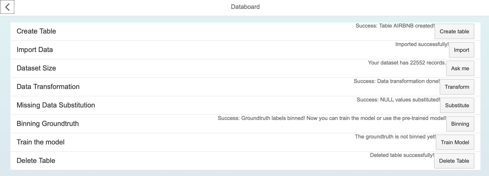
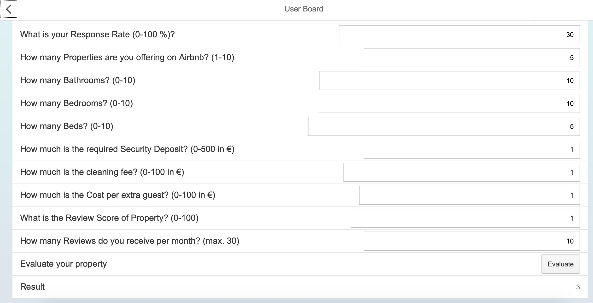

# hanaPAL-Airbnb
Use HANA PAL functions to make predictions on Airbnb prices for apartments in Berlin

### About this repository
This repository is not aimed for free distribution of the developed application by cloning the project. The access to database, which is the core of the application is removed. This repository is supposed to showcase the first Machine Learning driven application I have developed, by presenting it on the code level.

### Background
This project is created for the university module Database Concept and Technologies in the 6th semester of bachelor's studies Business Computing at HTW Berlin. The assignment is about dealing with SAP HANA and its functions in order to create an application using SAPUI5 for a certain use case. The scenario I chose is Airbnb price category classification. The data I found on Kaggle are about housings which are located in Berlin, Germany:

Details about the dataset will be described in the text below, or you can also go to Kaggle to have a closer view on the lovely [dataset](https://www.kaggle.com/brittabettendorf/berlin-airbnb-data#listings_summary.csv).

### About the application
The application is made for 2 different types of user: 

1. As a data admin, you are able to load the data, pre-process it before starting using the application. You can either use the pre-trained model or replace it by a model, that you start to train from zero. The current limitation for data admin is obvious: He is able to execute each single action, but has to follow the pre-defined steps.

2. As an Airbnb housing provider, you are able to provide the information of your housing in order to get an estimation of housing value. There are 10 classes where 1 indicates the cheapest kind of housing, so housing with index 10 stands for the highest price category, depending on the input variables. 

### General approach

The basic idea I had, from the beginning, was to train a standard neural network within SAP HANA in order to make predictions on housing price category. HANA has a very interesting library called PAL ([Predictive Analytics Library](https://help.sap.com/viewer/2cfbc5cf2bc14f028cfbe2a2bba60a50/2.0.03/en-US/c9eeed704f3f4ec39441434db8a874ad.html)). It offers interesting procedures such as Neural Networks, PCA, Recommender System and several preprocessing algorithms. For my application, I was mainly using the Neural Network algorithm for training and prediction, but also built a Binning model and substituted missing values by statistical values. Of course there are decisions which might be made differently in order to train a better model, but for the purpose of learning by doing, it was a deliberate decision to do that.

### Outcome

What has been achieved:
- The data admin is now able to create table, import data and follow the further pre-processing steps such as binning groundtruth, transforming data by eliminating NULL or empty strings. He can choose to re-train the model or keep using the pre-trained model. If he wants to restart, he can simply delete the airbnb table and restart the whole process.
- The user is now able to provide information about his Airbnb apartment and some general profile information. The input fields require him to respect the restrictions, for example the max value, or digit-only fields and particularly the correct format for the address. After fulfilling all requirements, he can press the button Evaluate and gets a result for his Airbnb property. In the range of 1-10, where 10 stands for the best, he can get the predicted class from the Neural Network model.

The Neural Network in SAP HANA is not easy to train and evaluate. The evaluation metrics are disabled per default, so all I had was the cost after the training, in my case, it was about 0,332, surely not the best value, but it was achieved after 200 iterations with Batch Gradient Descent. The cost was decreasing extremely slowly, although I had only 3 layers with 50, 20 and 10 neurons. The suspicion of Vanishing Gradient problem exists, but it could also base on other reasons. 

### SAPUI5

Databoard:

Userboard:

### Potential optimizations
1. In backend, there are mostly several checks which are meant to prevent bad decisions, e.g. binning data before importing them. These checks can be summed up to a SQL procedure. During development, I tried to create these procedures in order to avoid calling the database multiple times just for the precondition check, but some processing steps later, the procedure will be displyed as invalidated. This is one of the weak spot in backend: Having a long and complex if-else structure.
2. For learning purpose, I decided to try the function which can substitute missing values in the table AIRBNB. But it turns out that the data will be changed too much in a general way, because too much data were missing. This changed the original dataset and had an impact on the learning process of the Neural Network model. 
3. The SQL procedures were very difficult to create. Sometimes the procedure cannot be created because a table, which is involved in the procedure, is missing before creation of the procedure itself. HANA will display an error of creation, because it requires the existence of the table, although that missing table is meant to be created within the procedure. The existence of involved database elements as requirement to create procedure also affect columns.
4. The databoard could have more features: As a data admin, I would like to have the current tables displayed. I would like to have more insights about the data and what exactly is happening in the background.
5. The userboard could have a better ordering of questions. Seperating personal data section from apartment data section.
6. The last improvement is a personal one: I should have analyzed the data in the csv file before starting the assignment. Having a look on the tendencies of data, the outliers etc., it would give me a better feeling of what a well trained model really looks like. 